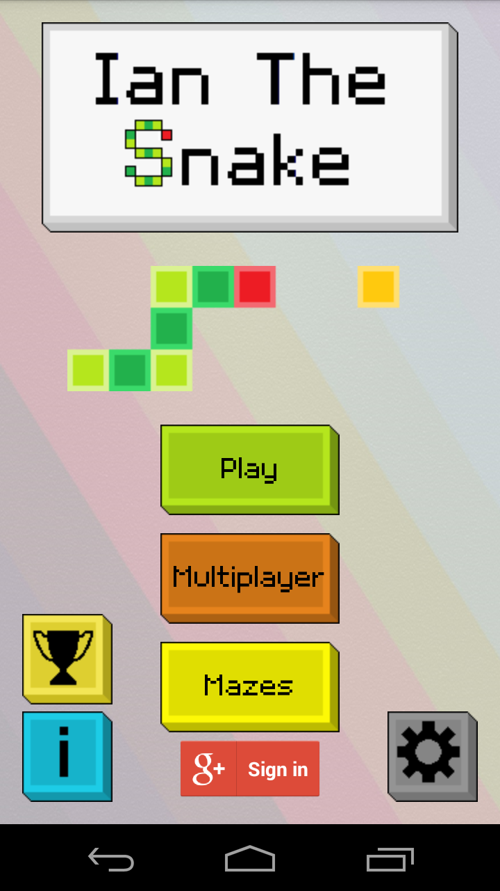
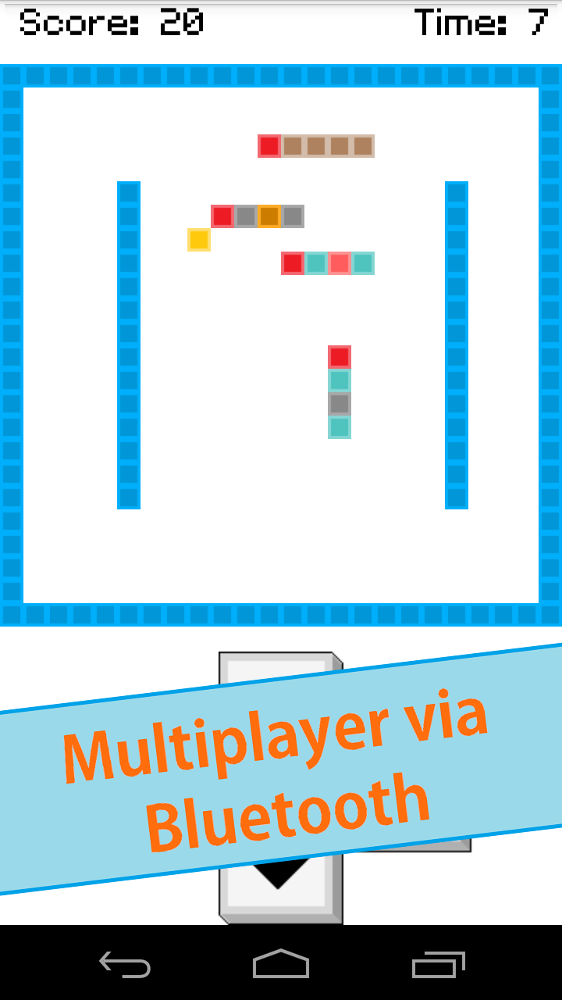
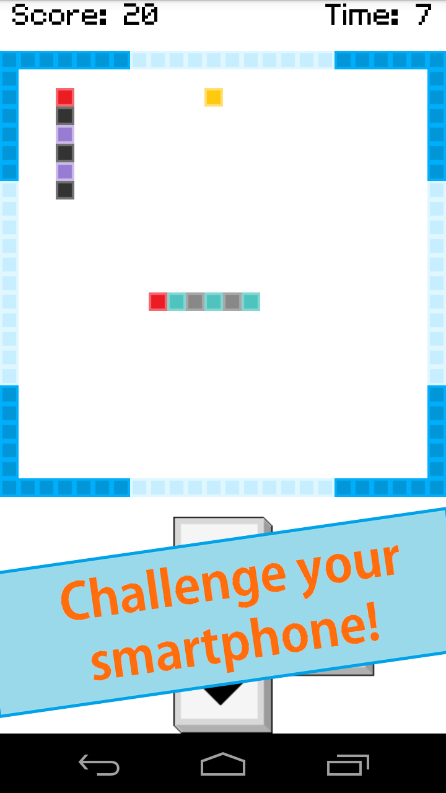

A mobile Android game inspired by the well known game Snake, it was the first game i ever released.
It uses the same mechanics of the original game, such as eating, growing and avoid walls, but it can be played in multiplayer via bluetooth against others or against the AI.

I developed the game completely from scratch using only the native language (Java) of Android in 2014 in Eclipse with the ADT Plugin that are now obsolete, so it needs to be reworked to make it compile in Android Studio. Because it's an old project it's also written in my native language (italian) so it can be difficult to read for non italian readers.

The important features developed for the game are:
- Bluetooth connection with other Android devices where one hosts the server while others act as clients. The server host manages all the game logic (such as movements, eating, growing, dying, score informations,...) while the clients receive periodic updates on the game state and send user input to the server to be processed.
- AI of the snakes based on the A* (AStar) algorithm to find the best path to reach food and to avoid walls, the player and other obstacles.
- Google Play Services integration to upload highscores and show global leaderboards.
- Tile based Map and snakes drawn with the use of Canvas.
- User Interface developed in a MVC (Model-View-Controller) fashion.

The game has been published on Google Play completely free and without ads: https://play.google.com/store/apps/details?id=com.ianthesnake

Some screenshots:

Developed in 2014 by:
Alessandro De Francesco